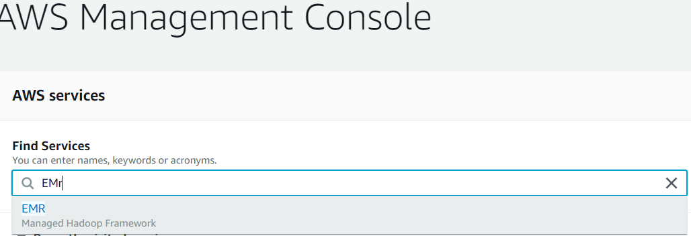
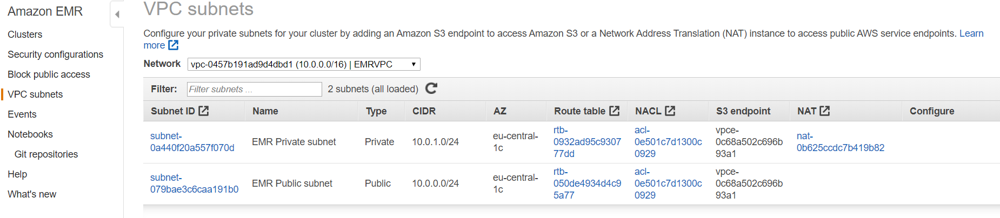
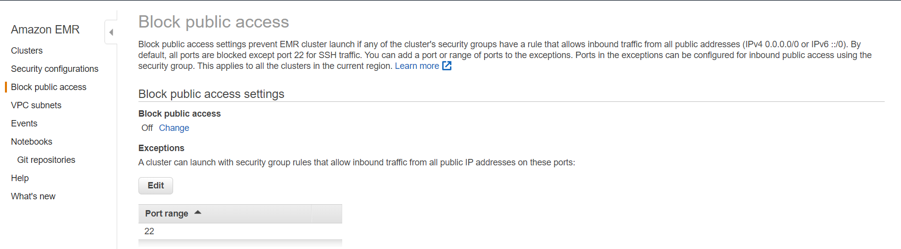
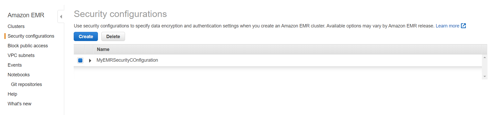
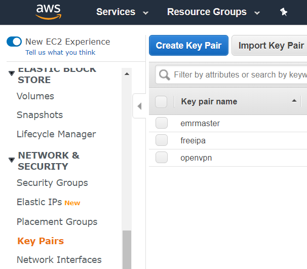
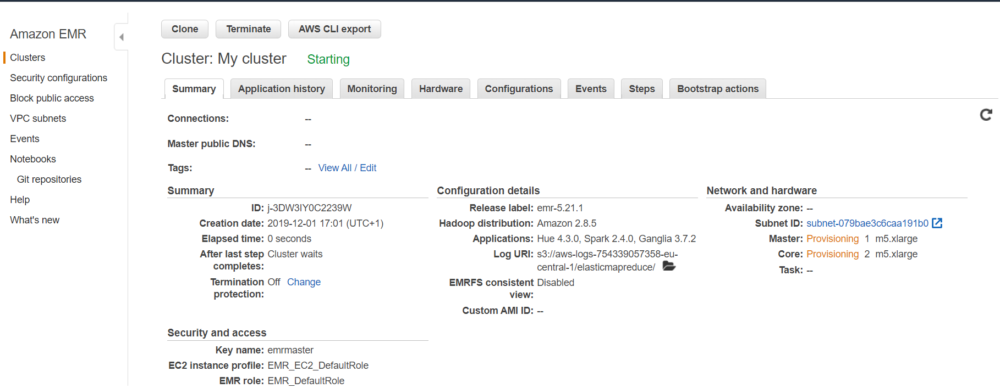
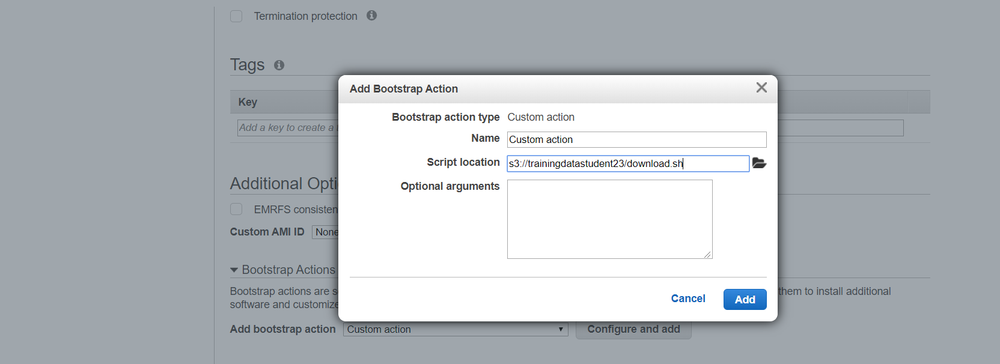
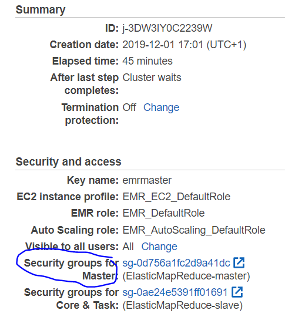
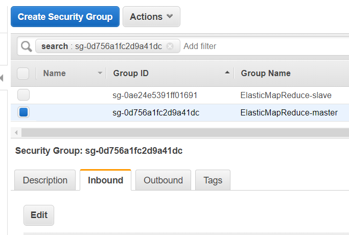
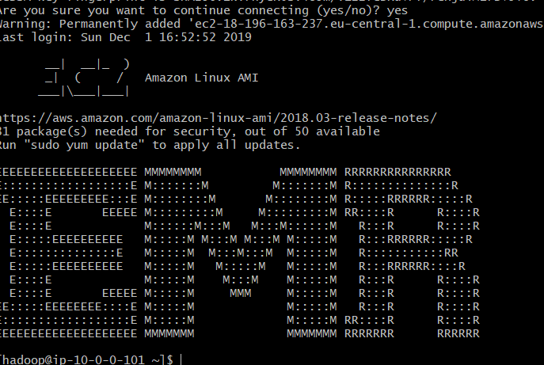

# EMR Cluster Installation

## Prerequisites

Make sure you have received your AWS:
* Account ID or alias
* User name
* Password

## Exercise I - Get familiar with EMR Mgmt Console

1 Go to https://aws.amazon.com/console/ and sign in to your AWS account

2 Verify that you are logged in to the Frankfurt AWS Region

3 Select the EMR Service

4  Go to VPC subnets Tab and verify that EMRVPC is present and that 2 subnets (public and private) are also configured 

5 Verify that
* S3 endpoint is set for both subnets
* NAT Gateway is associated with the private subnet
* *Configure* column is empty

What does this mean?

6 Go to Block Public Access tab. Verify that it is disabled. What does this mean?

 

7 Go to Security Configurations Tab (we will do a review of the available options)

* Click on Create

* Specify the name, e.g. MyEMRSecurityConfiguration
* Read the description of available options and optionally select
   * **_S3 encryption - Check it_** and select the SSE-S3 encryption mode
   * **_Enable at-rest encryption for local disks - Check it_** and select AWS KMS and the emr_ebs_master_key (if they key doesnt exist go to KMS and create it: for permissions (Define key usage permissions, Step 4) add roles EMR_DefaultRole and EMR_EC2_DefaultRole )
   * Enable in-transit encryption - leave it unchecked. Verify with the presenter that you understand the meaning of it.
   * Enable Kerberos authentication - leave it unchecked. Verify with the presenter that you understand the meaning of it.
   * Use IAM roles for EMRFS requests to Amazon S3 - leave it unchecked. Verify with the presenter that you understand the meaning of it.
* Click on Create
* Verify that your EMR Security Configuration was created.
* As we will not be using Security Configuration in this exercise delete it.

8 Before the cluster can be created we need to create EC2 Keypair (**emrmaster**)

* Go to EC2 Service and search for Keypairs.
* CLick on Create Key Pair. Enter **emrmaster** as key name.  
* Save locally the emrmaster.pem file

## Exercise II - Create an EMR cluster

Its time to create our first EMR cluster.

* Go to Cluster tab and click on Create cluster 
* Click on Go to Advanced Options

* On Step 1 page select
    * Release - emr-5.23
    * Applications - Spark 2.4.0, Hadoop 2.8.5, Ganglia 3.7.2, Hue 4.3.0, Tez, Hive, HCatalog
    * Do not mark - AWS Glue Data Catalog settings (optional)
    * Edit software settings - leave blank
    * Steps (optional) - verify that Clusters enters waiting state
    * Click Next 
    
* On Step 2 page select    
    * Instance group configuration - Uniform instance groups
    * Network - EMRVPC
    * Subnet - Choose EMR Public Subnet
    * Root device EBS volume size - leave the default (10 GB)
    * Leave the defaults for Node Type (Master - 1, Core - 2, Task - 0) and Instance Type (m5.xlarge)
    * Click Next 
* On Step 3 page select  
    * Cluster Name - leave the default
    * Enable Logging - set the S3 log location (leave the default location)
    * Enable Debugging - set the S3 log location (leave the default location)
    * Disable Termination protection
    * Disable EMRFS consistent view (under Additional Options)
    * Click Next
* On Step 4 page select
    * EC2 key pair - choose **emrmaster**
    * Permissions - Default (EMR role, EC2 instance profile, Auto Scaling role)
    * Authentication and Encryption - choose None (we deleted the Security Configuration before)
    * EC2 Security Groups - leave the default setting (EMR Service will create 2 security groups)
    * Click Create Cluster
        
The cluster will be in creating state, wait till it finishes (ca. 3 - 10 min). 
In the meantime go to EC2 dashboard and view the EC2 instances being provisioned. 
Wait till the cluster creation process finishes (final state has to be Waiting).

      
  
## Exercise III - Create a cluster bootstrap action (on startup and shut down)  

You can use a bootstrap action to install additional software or customize the configuration of cluster instances. 
Bootstrap actions are scripts that run on cluster after Amazon EMR launches the instance using 
the Amazon Linux Amazon Machine Image (AMI). 
Bootstrap actions run before Amazon EMR installs the applications that you specify when you create the cluster and 
before cluster nodes begin processing data. If you add nodes to a running cluster, bootstrap actions also run on 
those nodes in the same way. 
You can create custom bootstrap actions and specify them when you create your cluster. 

We will create 2 bootstrap actions - one for startup and one for shutdown.    

### Create a bootstrap action on cluster startup
* Go to S3 Mgmt Console and create a bucket (with default settings, place it in the Frankfurt region), name it e.g. trainingdatastudent$X (substitute X with you user name). The name must be unique.
* Upload the script from  [here](http://elasticmapreduce.s3.amazonaws.com/bootstrap-actions/download.sh) into trainingdatastudent$X
* Check contents of this file
* Go now to EMR Mgmt Console and create a new EMR Cluster (terminate the previous one if still running) with the options used in previous exercise (e.g. 5.23 EMR) on creating the EMR cluster.
* In Step 3 General Cluster Settings click on Bootstrap Actions -> Custom Action -> Configure and add
* Set the action name and specify this S3 path to example script s3://trainingdatastudent$X/download.sh
~~~~
* Click Next and then Create Cluster
* Wait till the cluster starts and login then to the master node 

`
ssh -i emrmaster.pem  hadoop@$master-public-dns-name
`

If you are not able to login then you have to edit the security group for "Security groups for Master":
 
* Click on the group, select it on EC2 Dashboard and click Edit in Tab Inbound
 
* Add SSH Rule, enter your IP or 0.0.0.0/0 and click Save
* Verify again that the ssh command succeeds now

`ssh -i emrmaster.pem  hadoop@$master-public-dns-name`

* Verify that the folder /home/hadoop/contents exists (it should be created by the bootstrap action)

`
ls /home/hadoop/contents
`
### Create a bootstrap action on cluster shutdown

When using Amazon EMR versions 4.0 and later, you must manually create the 
/mnt/var/lib/instance-controller/public/shutdown-actions/ directory on the master node.
 It doesn't exist by default; however, after being created, scripts in this directory nevertheless run before shutdown.
 
 * Login to the master node
 * Create the directory (it may exist if you created the bootstrap action for startup)

`
ls /mnt/var/lib/instance-controller/public/shutdown-actions/
`

`
mkdir /mnt/var/lib/instance-controller/public/shutdown-actions/
`
  * Create a script in this directory that will upload a file to s3 (to verify that it run on shutdown).
  * The example below assumes that there is a file /home/hadoop/contents/README on master node, create it if it doesnt.

`
touch /mnt/var/lib/instance-controller/public/shutdown-actions/run.sh
`

`
echo '#!/bin/bash' >> /mnt/var/lib/instance-controller/public/shutdown-actions/run.sh
`

* Below enter value for $YOURS3BUCKET(the bucket you created previously) and execute then:  

`
echo 'aws s3 cp /home/hadoop/contents/README s3://$YOURS3BUCKET/README$(eval "hostname")' >> /mnt/var/lib/instance-controller/public/shutdown-actions/run.sh
`

`
less /mnt/var/lib/instance-controller/public/shutdown-actions/run.sh
`

* Terminate the cluster and verify in S3 if the file was uploaded (wait till the cluster terminates). Delete this file afterwards.
* If an action should be taken on each node (instead only on master), then the script would need to be copied to each cluster node
   
