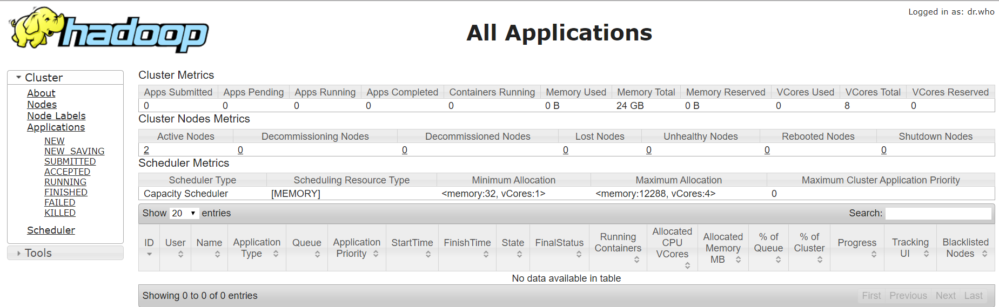
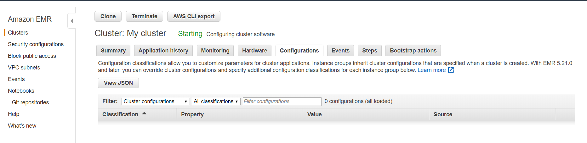
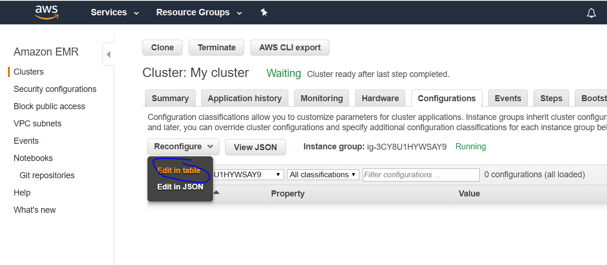
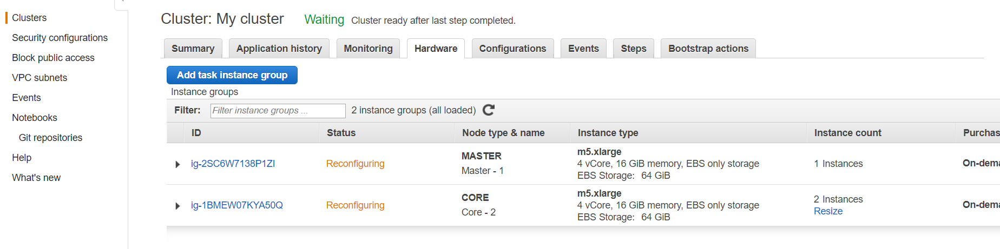
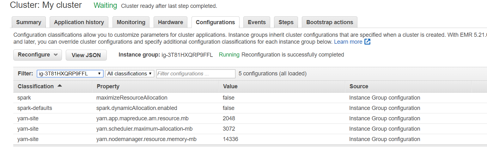

# EMR Cluster Basic Workflows

## Prerequisites

* EMR Cluster pem key (emrmaster.pem)
* A running EMR Cluster (if its not running please create one in version EMR 5.23 as described in chapter EMR Cluster Installation)
* On windows:
    * Either git bash (ssh command) or putty installed.
    * If putty then use puttygen to convert the emrmaster.pem into emrmaster.ppk file

## Exercise I - enable web access

1 We will create a ssh local port tunnel to EMR to be able to directly query UI of 
spark history server, YARN ResourceManager, Hue, Ganglia and Tez.

2 On https://docs.aws.amazon.com/emr/latest/ManagementGuide/emr-web-interfaces.html there is a list of the host and 
port mappings. Note the IP and ports for hue, ganglia, spark history, tez ui server  and YARN ResourceManager

**NOTE**
With Amazon EMR versions 5.25.0 and later, you can connect to Spark history server UI from the cluster Summary page
 or the Application history tab in the console. Instead of setting up a web proxy through an SSH connection, 
 you can quickly access the Spark history server UI to view application metrics and access relevant log files for active and terminated clusters. 
For more information, see Access Spark History Server UI from the Console in the Amazon EMR Management Guide.

**NOTE**
There are multiple issues with tez-ui for EMR < 5.26.

3 Verify (using git bash or putty) that you can connect via ssh to the master node

`
ssh -i emrmaster.pem  hadoop@$master-public-dns-name
`

If you are not able to then you have to edit the security group for "Security groups for Master":
 
* Click on the group, select it on EC2 Dashboard and click Edit in Tab Inbound
 
* Add SSH Rule, enter your IP or 0.0.0.0/0 and click Save
* Verify again that the ssh command succeeds now

`ssh -i emrmaster.pem  hadoop@$master-public-dns-name`

4 Lets create a ssh tunnel that will map the local ports to remote ports. We will map 5 ports defined above in one command (using git bash)

5 Execute in git bash the following command (substitute $MASTER_PUBLIC_DNS_NAME_OF_YOUR_CLUSTER with the EMR master node dns entry)

`
export master_public_dns_name='$MASTER_PUBLIC_DNS_NAME_OF_YOUR_CLUSTER'
`

`
echo $master_public_dns_name
`

`
ssh -i emrmaster.pem -L 8886:$master_public_dns_name:8088 -L 8887:$master_public_dns_name:18080 -L 8888:$master_public_dns_name:8888 -L 8889:$master_public_dns_name:80 -L 8890:$master_public_dns_name:8080 hadoop@$master_public_dns_name
`

6 Verify in browser for the 5 applications that UI is accessible - e.g. type locahost:8886 in local browser to view EMR Resource Manager UI

## Exercise II - View current Hadoop and Spark Settings 

### Part I - View current setting and UI (Resource Manager, Spark History, ganglia, hue)

Login to YARN Resource Manager Page and answer the following questions:
* How much RAM and CPUs available are reported as being available for the cluster?
* How many hosts? Can you tell to which group they belong (master, core, task)?
* What is the minimum and maximum allocation in terms of CPU and memory a job can get?
* What scheduler is being used?
* What scheduler queue is configured?
* How much RAM and CPU can be allocated to an application master (max) ?
* Can you find the current configuration parameter values being used 
(coming from files like yarn-default.xml,hdfs-default.xml,mapred-default.xml,core-default.xml? 

Login to Spark History Server:
* Can you see the currently used spark details?

Login to Hue:
* Enter an admin user name and a password.
* Find the UI for Oozie Jobs / Workflows / Schedules
* Find the UI for HDFS
* Find the UI for hive 

Login to Ganglia:
* Check the various dashboards

Login to TEZ UI:
* Is TEZ UI working?
* Check the various dashboards

### Part II - Run example spark job with current settings

* Go to EMR Mgmt Console to the Tab Configuration
  
* Click on Filter and check if for any Instance Groups (you should find 2, master and core) there are any configuration defined.
* Choose the Instance Group (ig-***) that matches the core instance group (instance group details are in tab Hardware).
* We will change the EMR spark setting **maximizeResourceAllocation**. Read about what it does [here](https://docs.amazonaws.cn/en_us/emr/latest/ReleaseGuide/emr-spark-configure.html#emr-spark-maximizeresourceallocation).
* Before setting this parameter to **true** note the values used currently for
    * spark.default.parallelism
    * spark.driver.memory
    * spark.executor.memory
    * spark.executor.cores
    * spark.executor.instances
    * spark.dynamicAllocation.enabled

Where this can be checked (search for the file /etc/spark/conf/spark-defaults.conf and analyze its content)?
Which values have default values set explicitly?
Which values are not set? What are then the default values?

Write down your assumed default values.

Login to the cluster through ssh and run

`
spark-submit --help
`

Note that some options dont require the --conf flag, but most do.

Run the SparkPi example with spark-submit without any specific values

`
spark-submit --class org.apache.spark.examples.SparkPi --master yarn --deploy-mode cluster  /usr/lib/spark/examples/jars/spark-examples.jar 
`

Do you understand what deploy-mode=cluster means?

Check the value of PI with 

`
yarn logs -applicationId $app_id
`

Go to Spark history server and write down the runtime values for 
* spark.default.parallelism
* spark.driver.memory
* spark.executor.memory
* spark.executor.cores
* spark.executor.instances
* spark.dynamicAllocation.enabled

Do they match?
Why spark.executor.instances is not set?

Lets try to set them explicitly to (--conf=key=valye ):
* spark.default.parallelism (200)
* spark.driver.memory (2G)
* spark.executor.memory (4G)
* spark.executor.cores (1)
* spark.executor.instances (2)
* spark.dynamicAllocation.enabled (false)

`
spark-submit --class org.apache.spark.examples.SparkPi --master yarn --deploy-mode cluster \
  --conf spark.default.parallelism=200 \
  --conf spark.driver.memory=2G \
  --conf spark.executor.memory=2G \
  --conf spark.executor.cores=1 \
  --conf spark.executor.instances=2 \
  --conf spark.dynamicAllocation.enabled=false \
  /usr/lib/spark/examples/jars/spark-examples.jar 
`

Go to Spark UI and check if these values were used? 

Try to set bigger driver memory and executor memory - what will happen? When will Spark not start? What is the max value for driver and for executor?

Try to find using `yarn logs -applicationId $app_id  | grep MB` the memory allocated (which overhead?) to each executor and driver?

 ## Exercise III - Change current Hadoop and Spark Settings (in a running cluster)
 
 With Amazon EMR version 5.21.0 and later, you can override cluster configurations and specify additional configuration classifications
  for each instance group in a running cluster. 
  You do this by using the Amazon EMR console, the AWS Command Line Interface (AWS CLI), or the AWS SDK. 
  For more information, see [Supplying a Configuration for an Instance Group in a Running Cluster](https://docs.aws.amazon.com/emr/latest/ReleaseGuide/emr-configure-apps-running-cluster.html).

### Part I - Change spark setting (EMR only!) _maximizeResourceAllocation_ to true  
* Go to EMR Mgmt Console to the Tab Configuration
  
* Click on Filter and check if for any Instance Groups (you should find 2, master and core) there are any configuration defined.
* Choose the Instance Group (ig-***) that matches the core instance group (instance group details are in tab Hardware).
* We will change the EMR spark setting **maximizeResourceAllocation**. Read about what it does [here](https://docs.amazonaws.cn/en_us/emr/latest/ReleaseGuide/emr-spark-configure.html#emr-spark-maximizeresourceallocation).
* Before setting this parameter to **true** note the values used currently for
    * spark.default.parallelism
    * spark.driver.memory
    * spark.executor.memory
    * spark.executor.cores
    * spark.executor.instances

* Now we will change this setting to true. To do it go to tab Configuration, select the Core Instance Group nad click on **Edit in table**
  
* Enter **spark** for Classification, property name **maximizeResourceAllocation** and property value **true**
* Check the box "apply to all instance groups"
* Wait till the change is propagated (status will change from Reconfiguring to Running). 

* Go to Events and verify that an appropriate event is also there.
* Now we will run the example spark with default settings

`
spark-submit --class org.apache.spark.examples.SparkPi --master yarn --deploy-mode cluster  /usr/lib/spark/examples/jars/spark-examples.jar 
`

What values were used for  the parameters mentioned [here](https://docs.aws.amazon.com/emr/latest/ReleaseGuide/emr-spark-configure.html#emr-spark-maximizeresourceallocation)?

Check the values set in /etc/spark/conf/spark-defaults.conf and in web ui (Environment and Executors tabs). What can you observe?

### Part II - Change spark settings and Hadoop settings 
Now lets assume that we are not happy with the setting of **maximizeResourceAllocation**. We also want to disable dynamic allocation.

Lets assume we want to limit a Spark Job to run with driver memory set to 2 GB max (remember the driver overhead setting..).
Additionally we are not happy with the fact that only 12 GB out of 16 GB is allocated to Yarn (per core node). Lets change it to 14 GB.
We also want to limit the memory one container (in spark terms its one executor) to 3 GB.

How to accomplish this?

Go back to the tab where you previously set **spark** classification, and do 3 things
* Modify (or remove) the **spark** classification to the value of false
* Add a **spark-defaults** classification: spark.dynamicAllocation.enabled=false
* Before modyfying the following yarn related parameters check their current values in Yarn Resource Manager UI (under Configuration) - write down the current values.
* Add a **yarn-site** classification: yarn.app.mapreduce.am.resource.mb=2048
* Add a **yarn-site** classification: yarn.scheduler.maximum-allocation-mb=3072
* Add a **yarn-site** classification: yarn.nodemanager.resource.memory-mb=14336
* Check the box "apply to all instance groups"

Click Save Changes. Modify in tab Hardware the status of Instance Groups as it changes to Reconfiguring.

While waiting on the above change to finalize go to [here](https://docs.aws.amazon.com/emr/latest/ReleaseGuide/emr-release-5x.html#emr-5230-class) and check which classifications are available for 5.23 

Check the configurations in UI:

Check the Yarn related configurations in Resource Manager UI (Under Configurations), you can enter directly http://localhost:8886/conf.
Check also if on Resource Manager UI in Cluster Metrics if Memory Total equals to 28 GB (2 nodes * 14 GB) 

Check in /etc/spark/conf/spark-defaults.conf that spark.dynamicAllocation.enabled=false

Now its time to run spark again and experiment with the settings.

Try to run spark with those settings
* set the driver memory to 2g RAM. Does Spark run? 
* set the executor memory to 3g RAM. Does Spark run?
* set the number of executors to 8 and 2g RAM. Does Spark run?
* set the number of executors to 7 and 2g RAM. Does Spark run?

  

