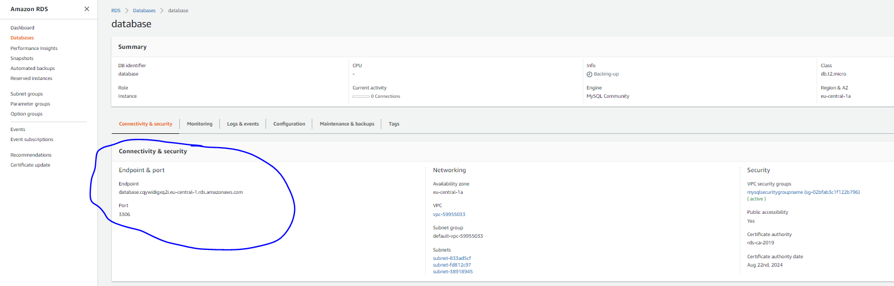
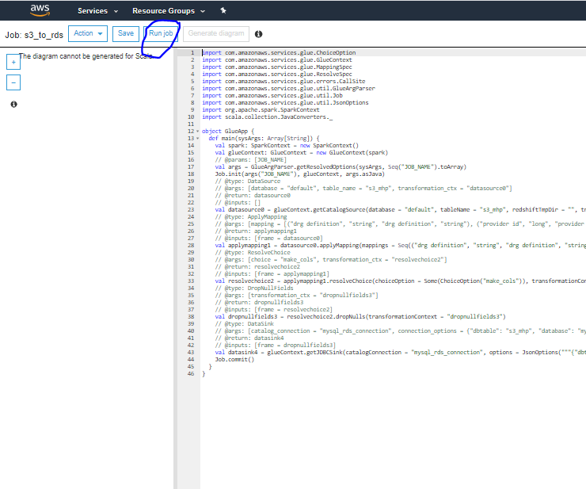

We will show how to leverage Glue Data Catalog with EMR

General documentation can be hound [here](https://docs.amazonaws.cn/en_us/emr/latest/ReleaseGuide/emr-metastore-external-hive.html)

# Exercise I - Create a EMR Cluster with Glue Data Catalog as external hive metastore

We will analyze the Sofia air quality data set https://airsofia.info/.

A copy of the dataset is stored in s3 bucket at s3://trainingdatabecloudata/sofia_air_quality/temp    
We will copy this data set to a bucket within your account and point EMR Hive to it

Follow these steps

* Create a bucket in your AWS account (accept default settings), try to give it a meaningful name
* Open on windows your command prompt
* Issue the following command to copy the dataset from original location to your bucket in S3 (if you havent done so already in previous exercises)


`
aws s3 cp s3://trainingdatabecloudata/sofia_air_quality/temp s3://$your_bucket/sofia_air_quality/temp --recursive  --profile $YOUR_PROFILE
`


* Create an EMR Cluster v 5.28 (shut down any other running EMR Clusters if you have them running)


* **NOTE**: We could use an older EMR Version but this time lets start the newest EMR Version
* Now ssh to master node and type
`
hive
`

* We will create 3 tables (sofia_original_dataset (CSV non partitioned table), 
sofia_orc (ORC non partitioned table) and sofia_orc_part (ORC partitioned table)) that will be available 
in Glue Data Catalog (and hence also in Athena). 

* Execute the following statement (substitute **$YOURBUCKET** with the name of the bucket you created) to
create the sofia_original_dataset table

`
CREATE EXTERNAL TABLE sofia_original_dataset (
api_call_id int,
sensor_id SMALLINT, 
location SMALLINT,
lat float, 
lon float,
event_timestamp string,
pressure float,
temperature float,
humidity float
)
ROW FORMAT DELIMITED
FIELDS TERMINATED BY ','
STORED AS TEXTFILE
LOCATION 's3://$YOURBUCKET/sofia_air_quality/temp'
tblproperties ("skip.header.line.count"="1");
`

* You may get an error with TEZ Execution  (try to execute select count(*) from sofia_original_dataset). If so then go to Athena Mgmt Console -
you will be prompted to setup a default s3 location for your Athena Query Results. 

* Create in S3 Mgmt Console within your bucket a directory called athena_query_results and set it on Athena Mgmt Console popup like on the image below: 


* To verify on Athena Mgmt Console execute the following query:


* If you succeed then verify in hive that the count query stated before in hive works now.

* Execute the following statement (substitute **$YOURBUCKET** with the name of the bucket you created) to
create the sofia_orc table:

`
CREATE EXTERNAL TABLE sofia_orc (
api_call_id int,
sensor_id int, 
location int,
lat float, 
lon float,
event_timestamp string,
pressure float,
temperature float,
humidity float
)
STORED AS ORC
LOCATION 's3://$YOURBUCKET/sofia_air_quality/sofia_orc'
;
`

`
INSERT INTO TABLE sofia_orc SELECT * FROM sofia_original_dataset;
`

* Execute the following statement (substitute **$YOURBUCKET** with the name of the bucket you created) to
create the sofia_orc_part table:

`
CREATE EXTERNAL TABLE sofia_orc_part (
api_call_id int,
sensor_id int, 
location int,
lat float, 
lon float,
event_timestamp string,
pressure float,
temperature float,
humidity float
)
partitioned by(yearmonth int)
STORED AS ORC
LOCATION 's3://$YOURBUCKET/sofia_air_quality/sofia_orc_part'
;
`

`
set hive.exec.dynamic.partition.mode=nonstrict;
`

`
INSERT OVERWRITE TABLE sofia_orc_part PARTITION(yearmonth) SELECT 
api_call_id,
sensor_id, 
location,
lat, 
lon,
event_timestamp,
pressure,
temperature,
humidity,
replace(substr(event_timestamp,1,7),'-','')
FROM sofia_original_dataset;
`

* If you havent done previously measure the time (from hive cli or hue) for each table how long the following SQLs execute:
    * count the data set size
    * select api_call_id where api_call_id < 100
    * count the number of measures in 201812
    
* Now move to Glue Data Catalog Mgmt Console and check if the above created tables are visible in Glue Data Catalog.
* Navigate to the default database:

* CLick on View Data

* On the Athena Query Editor run the queries you run on hive cli/hue ui and measure 2 things:
    * execution time
    * Data scanned
* What are you observations?

* Now lets create a second EMR cluster (please terminate the first one) and verify that it sees the tables registered with our first EMR Cluster.
* Head to EMR Console and create a second EMR Cluster (terminate the first one) like you created the first one. Dont forget to set this option:

* Now ssh to master node and type

`
hive
`

* Verify that the tables are visible in default schema. Execute the following commands to do so:

`
show databases;
`

`
hive> use default;
`

`
hive> show tables;
`

* You should see the tables registered in glue (elb_logs, sofia_orc, sofia_orc_part, sofia_original_dataset)


# Exercise II - Create new tables from Athena that will be available also in EMR CLuster (with Glue Data Catalog as external hive metastore) 

* Lets create some tables (partitioned, ORC format and compressed) from Athena and see if they will be available from a new EMR Cluster.

* Please login to Athena and select the default database

* In the Athena Mgmt console click on **_"Whats New"_**


* View the new announcements and click on the Oct 2018 announcement: https://docs.aws.amazon.com/athena/latest/ug/ctas.html

* Follow the link and read what can be done with this functionality

* Lets create 2 tables to check the functionality
   * **_First table named sofia_orc_v_athena_partitioned_** that
   * in stored in ORC format
   * compression is set to SNAPPY
   * path in s3 is set to 's3://$YOUR_BUCKET/sofia_orc_v_athena_partitioned/'
   * is partitioned by yearmonth
   * contains columns api_call_id, sensor_id, location, yearmonth
   * contains the data for 201903
   * **_Second table named sofia_orc_v_athena_partitioned_v2_** that
   * is like the first table except that
   * the source table is sofia_original_dataset
   * to leverage partitioning we need to supply an "$EXPRESSION as yearmonth"
   
* Can the 2 tables be created and queried?
* Take a look at s3 folder structure and the files created. What do you think?
* Now lets use our EMR Cluster created in previous exercise (or create a new EMR cluster with Glue Data Catalog as hive external metastore) and verify that it sees the tables created above.
* NOTE: If you would create a new EMR Cluster dont forget to set this option:

* Now ssh to master node and type

`
hive
`

* Verify that the new tables are visible in default schema. Execute the following commands to do so:

`
show databases;
`

`
hive> use default;
`

`
hive> show tables;
`

* You should see the new tables registered in glue (sofia_orc_v_athena_partitioned, sofia_orc_v_athena_partitioned_v2)

* Is this functionality important? What kind of use cases it enables?


# Exercise III - Crawl an S3 Datastore to register data with Glue Data Catalog

Now we will use a sample dataset (medical helathcare providers data) stored in s3 bucket at s3://awsglue-datasets/examples/medicare/Medicare_Hospital_Provider.csv    
We will copy this data set to a bucket within your account and run a Glue Crawler on it to register it with Glue Data Catalog

Follow these steps:

* Create a bucket in your AWS account (accept default settings), try to give it a meaningful name
* Open on windows your command prompt
* In the command below substitute **$YOUR_PROFILE** with your aws profile name and **$your_bucket** with the bucket you created previously.
* Issue the following command to copy the dataset from original location to your bucket in S3

`
aws s3 cp s3://awsglue-datasets/examples/medicare/Medicare_Hospital_Provider.csv s3://$your_bucket/ingest/healthcare/MHP/Medicare_Hospital_Provider.csv   --profile $YOUR_PROFILE
`

* Verify in S3 Mgmt Console that the csv file got copied
* Login to AWS Glue Console
* Go to Crawlers and click Add Crawler


* Name the crawler **mys3crawler** and click Next
* For Crawler Source Type specify Data stores
* For Data Store specify S3 and enter the path to the directory where MedicareHospitalProvider.csv is stored (s3://$your_bucket/ingest/healthcare/MHP/)


* Click Next
* For "Add another data store" choose No and click Next
* On the IAM role Page select "Create an IAM role", provide a name for the service role (e.g. mys3crawlerservicerole) adn click Next
* On the Schedule Page choose "Run on demand" (Frequency) and click Next 


* For Database choose "default" and for prefix "s3_". Click Next.


* Click Finish.
* The crawler was created. Click on "Run it now".


* Wait till the Crawler finishes. If everything went ok you should see the following message:


* Go to the glue database default and check if a table named “s3_mhp” (table name  equals to prefix + directory name)


* Click on table name and view the metadata about it:


* Go back to table view and click Action -> View Data
* You will be redirected to Athena Mgmt Console with 10 rows displayed (preview query) where you can run different queries against the registered table:


* Run some queries / play with the data set.


# Exercise IV - Create a Glue ETL Job that will copy data from Exercise III into an RDS database

We will need few things accomplished to copy the data we have in s3 into RDS using Glue ETL (why would we want to do this?):
* Create a RDS database (mysql)
* Create a Glue JDBC Connection to it
* Create (generate based on metadata) a Glue Job to copy the S3 hospital provider dataset into mysql

Please follow those steps:

* Login to RDS Mgmt Console and create a mysql database like on the screenshots. 
Make sure to select default vpc and select the database as public accessible.  


* Click Create database
* Wait till the database is created.
* Note the endpoint and port. You will need it in the next point to connect to an rds mysql.



* To verify use a SQL tool (e.g. SQL Developer) to connect to the RDS mysql database (using the admin user)


* Execute this SQL to create a schema/database called **my_tables** (if you dont ahve an sql tool with mysql connector ask the lecturer to create the schema)

`
CREATE  SCHEMA my_tables;
`

Before creating the Glue connection and Glue Job we need to modify the glue service role to allow s3 access.
* Go to IAM Mgmt console, select Policies and find the Customer Managed Glue Service Policy 


* Edit it with this content
```
{
    "Version": "2012-10-17",
    "Statement": [
        {
            "Effect": "Allow",
            "Action": "s3:*",
            "Resource": "*"
        }
    ]
}
```


* Save it


Now lets us create the Glue Connection adn Glue Job.

* Login to Glue Mgmt Console and click on Connections -> Add Connection:
* For Connection name enter **mysql_rds_connection**, set other properties like on screenshot (given that we created a mysql rds database):


* Construct the JDBC string, provide the VPC (default) you created the RDS in. Also provide the right security group (**mysqlsecuritygroupname**). 


* Click Next.
* On the final page click on Finish.


* Select the created connection and click on Test Connection. Select the glue service role created previously. Click Test connection.


* The connection will fail because inbound rules are not set correctly in the security group


* To fix it go to security group **mysqlsecuritygroupname**, edit it like (inbound rule for RDS) described [here](https://docs.aws.amazon.com/glue/latest/dg/setup-vpc-for-glue-access.html).
After setup the security group inbound rules should look like this: 


 
* Additionally create a S3 VPC endpoint for the default VPC like described [here](https://docs.aws.amazon.com/glue/latest/dg/vpc-endpoints-s3.html) 
* Restart the Connection Test.  
* Wait for the test to finish. The following message should be visible (in case of an error, drop and recreate the connection again):


* This connection will be used in the next Glue Job to move data from S3 to RDS.

* Login to Glue Mgmt Console and click on Jobs -> Add Job
* For 
    * Name type s3_to_rds
    * IAM role: select the available glue service role
    * Glue Version: Spark 2.4, Scala 2
    * Type: Spark
    * This job runs: A proposed script generated by AWS Glue
    * ETL language: Scala
    * Script file name: s3_to_rds
    * S3 path where the script is stored: create a directory in your S3 bucket and put the path here (s3://$BUCKET/$SCRIPT_DIRECTORY/)
    * Temporary directory: You can use the same directory like above (s3://$BUCKET/$SCRIPT_DIRECTORY/)
    * Catalog Options (optional) -> Use Glue Data Catalog as the hive metastore
* Click Next
* On the next page choose the input data set (**s3_mhp**) stored in s3 and click Next   
*  Choose "Change Schema" and click Next

* Choose “Create tables in your data target” on top of the page and 
    * Data Store: JDBC
    * Connection: the Connection created previously
    * Database name: my_tables
    * Click Next


* On the mapping column page leave the defaults and click “Save Job and Edit Script”
* On the Edit job page click “Run Job”



* Return to the Glue console and click the Job for details


* Wait and check if the job succeeded


* Connect to the mysql database and check if the data is there 


# Exercise V - Crawl the RDS database to register the dataset into Glue Data Catalog 

Now let us register the dataset in RDS into Glue Data Catalog too.

* Go to Glue Mgmt Console and select Crawlers -> Add Crawler
* Name the crawler **rds_crawler**
* For "Crawler source type" choose "Data stores"
* On the Data Store page enter the following settings


* On the page "Add another data store" select No
* On the "Choose an IAM role" page select the existing glue service role
* For frequency choose "Run on demand"
* On the Crawler Output page choose setting on the diagram


* Click on Finish and then run the Crawler. Wait till it finishes.


* Go to Glue Data Catalog default database and confirm the table was added.
