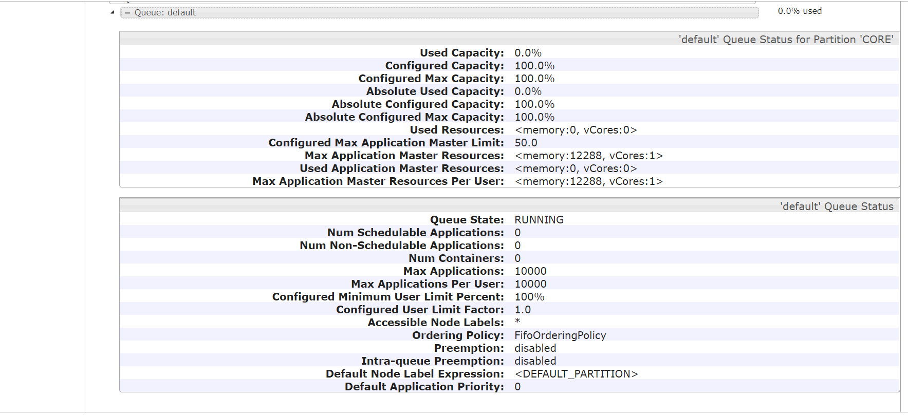
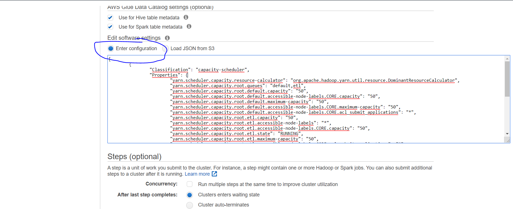
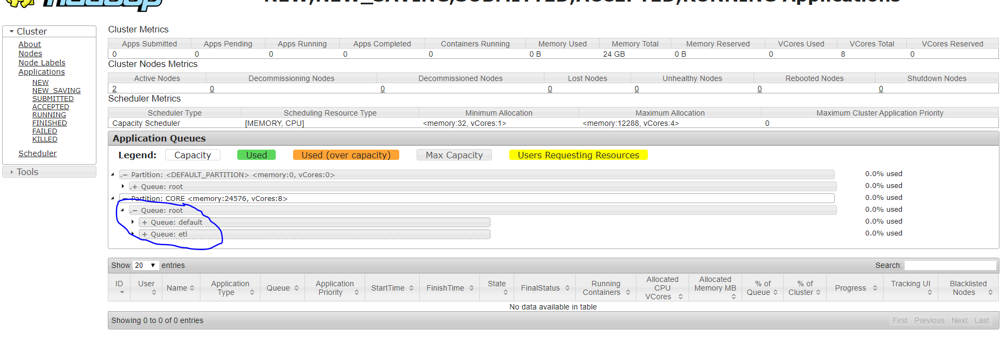
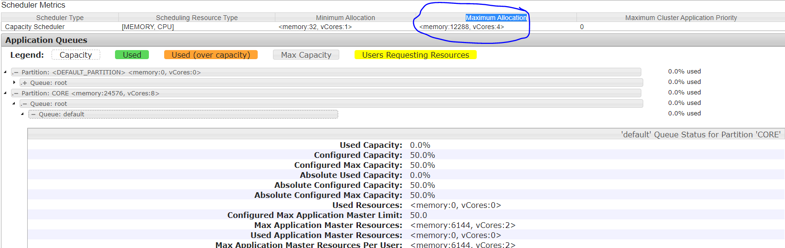
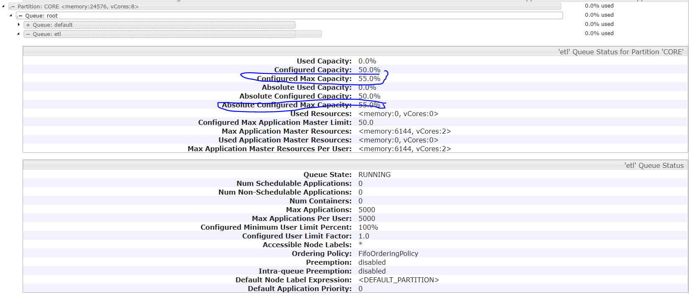

If you have a running EMR cluster with default configuration please go to _**$EMR_MASTER_NODE_DNS:8088**_ 
(if access in security group was enabled and master node is in public subnet) or if ssh local port forwarding is setup at 
_**localhost:8886**_ 

Click on Cluster and then on Scheduler.

Login to master node via ssh in 2 sessions and try to parallel run the following spark job:

How many CPUs will be used to run Application Master (spark driver)? 
How much RAM in total? Is the value bigger then the value on screenshot above (Max Application Master Resources per User)? 

`
spark-submit --class org.apache.spark.examples.SparkPi --master yarn --deploy-mode cluster \
  --conf spark.default.parallelism=200 \
  --conf spark.driver.memory=4G \
  --conf spark.driver.cores=1 \
  --conf spark.executor.memory=4G \
  --conf spark.executor.cores=1 \
  --conf spark.executor.instances=6 \
  --conf spark.dynamicAllocation.enabled=false \
  /usr/lib/spark/examples/jars/spark-examples.jar 
`

It should succeed because by default the Resource Calculator process only looks at memory, not at CPUs (although the theoretical limit of CPUs is set to 1).

Its defined in the file capacity-scheduler.xml:

The default resource calculator i.e org.apache.hadoop.yarn.util.resource.DefaultResourceCalculator uses 
only **memory** information for allocating containers and CPU scheduling is not enabled by default.

To use **both** **memory** as well as the **CPU**, the resource calculator needs to be changed to 
org.apache.hadoop.yarn.util.resource.DominantResourceCalculator in the capacity-scheduler.xml file.
  
_<property>
    <name>yarn.scheduler.capacity.resource-calculator</name>
    <value>org.apache.hadoop.yarn.util.resource.DominantResourceCalculator</value>
</property>_

Now lets increase the driver memory to 6 GB (in total it will be then over 12 GB allocated to Application Master) and run it simultaneously in 2 windows:

In one of the windows you should see the following output:

`
         client token: N/A
         diagnostics: [Thu Dec 12 12:14:28 +0000 2019] Application is added to the scheduler and is not yet activated. 
         Queue's AM resource limit exceeded.  
         Details : AM Partition = CORE; AM Resource Request = <memory:6784, vCores:1>; Queue Resource Limit for AM = <memory:12288, vCores:1>; 
         User AM Resource Limit of the queue = <memory:12288, vCores:1>; Queue AM Resource Usage = <memory:6784, vCores:1>;
`

Only after the first application finished , then the 2nd one gets scheduled.

EMR clusters by default are configured with a single capacity scheduler queue (default queue name: **default**) 
and are optimized to run 1 job at any given time - do you remember 2 related spark setting? 

It uses the FIFO fashion for assigning tasks on the cluster.
You can create and configure multiple queues in YARN Capacity Scheduler 
during the creation of a new EMR cluster or update the configurations 
on an existing EMR clusters.

Check [this](https://hadoop.apache.org/docs/r2.8.5/hadoop-yarn/hadoop-yarn-site/CapacityScheduler.html#Setting_up_queues) page for all the properties of Yarn Capacity Scheduler.
Please read about these properties:
* yarn.resourcemanager.scheduler.class - (conf/yarn-site.xml, we will need to set it in yarn-site classification later)
* Read the chapter about setting up queues [here](https://hadoop.apache.org/docs/r2.8.5/hadoop-yarn/hadoop-yarn-site/CapacityScheduler.html#Setting_up_queues)
* In the section Queue properties [here](https://hadoop.apache.org/docs/r2.8.5/hadoop-yarn/hadoop-yarn-site/CapacityScheduler.html#Queue_Properties) make sure you undertand these settings:
    * yarn.scheduler.capacity.<queue-path>.capacity
    * yarn.scheduler.capacity.<queue-path>.maximum-capacity
    * yarn.scheduler.capacity.<queue-path>.user-limit-factor
    * yarn.scheduler.capacity.<queue-path>.maximum-allocation-mb
    * yarn.scheduler.capacity.<queue-path>.maximum-allocation-vcores
       
* What do you think? Is setting a scheduler easy or complicated?

* There is the root queue udner which the default queue is setup. Please try tun a sample spark application on the follwoing queues:
    * --queue root  
    * --queue etl   (this queue doesnt exist)
* Do the spark job run on any of those 2 queues?  

# Exercise I   - Disable the default queue 10 min

* Now ssh to the master node and go to the directory /etc/hadoop/conf.empty/: 

`
cd /etc/hadoop/conf.empty/
`

* Lets edit a parameter (set yarn.scheduler.capacity.root.default.state to STOPPED from RUNNING):

`
sudo vi capacity-scheduler.xml
`

* Find the property and change the value to STOPPED as shown below:

`
<property>
    <name>yarn.scheduler.capacity.root.default.state</name>
    <value>STOPPED</value>
</property>
`

* Refresh the queues

`
 yarn rmadmin -refreshQueues
`

* Go to Resource Manager UI and check the queue status. It should be STOPPED. 

* Try to run a spark job.

* What happened?

* To finish the exercise set the status of this parameter to RUNNING again and run the refresh queue command as noted above.

# Exercise II   - Create a queue configuration with 3 queues

* Create a set of properties for 3 queues (default, etl, reports) where
   * default queue has the capacity of 25% and can extend max to 50%
   * etl queue has the capacity  of 45% and can extend max to 60%
   * reports queue has the capacity of 30% and can extend max to 35%
   * A user in queue reports can use max 70% of queue resources
   * A container in queue etl can have max allocated 2 CPUs and 2048 MB per container
   
HINT: Use the above defined properties, take a look at the page [here](https://hadoop.apache.org/docs/r2.8.5/hadoop-yarn/hadoop-yarn-site/CapacityScheduler.html#Setting_up_queues) and  [here](https://hadoop.apache.org/docs/r2.8.5/hadoop-yarn/hadoop-yarn-site/CapacityScheduler.html#Queue_Properties).
   
* Additional questions to the above setting:
 * How to limit how many parallel applications a user can trigger to a given queue?
 * How do you specify in spark on which queue a given spark job has  to run?
 * Can you limit which users are allowed to run jobs on which queues?
 

# Exercise III   - Create an EMR Cluster with 2 queues

EMR capacity scheduler leverages the concept of [YARN Node Labels](https://hadoop.apache.org/docs/r2.8.5/hadoop-yarn/hadoop-yarn-site/NodeLabel.html).
It makes the queue configuration harder. Additionally it is not possible to change most of the settings through online Configurations -> Reconfigure actions. It seems that 
you can either change it at cluster creation time and additinally at runtime but through manually editing the files @EMR cluster.

We will first supply a configuration at cluster creation time and later modify it at runtime manually.

Lets create an EMR Cluster with 2 queues:

* Please go to advanced options, select EMR 5.28 and Hue, Tez, Hive, SPark and HCatalog as the installed Software
* Proceed with default you used before besides that on Page 1 - Step 1: Software and Steps (see screenshot below) 
under Edit software settings enter the below provided JSON (format the JSON in editor first and take a look at it)

[
	{
		"Classification": "capacity-scheduler",
		"Properties": {
			"yarn.scheduler.capacity.resource-calculator": "org.apache.hadoop.yarn.util.resource.DominantResourceCalculator",
			"yarn.scheduler.capacity.root.queues": "default,etl",
			"yarn.scheduler.capacity.root.default.capacity": "50",
			"yarn.scheduler.capacity.root.default.accessible-node-labels.CORE.capacity": "50",
			"yarn.scheduler.capacity.root.default.maximum-capacity": "50",
			"yarn.scheduler.capacity.root.default.accessible-node-labels.CORE.maximum-capacity": "50",
			"yarn.scheduler.capacity.root.default.accessible-node-labels.CORE.acl_submit_applications": "*",
			"yarn.scheduler.capacity.root.etl.capacity": "50",
			"yarn.scheduler.capacity.root.etl.accessible-node-labels": "*",
			"yarn.scheduler.capacity.root.etl.accessible-node-labels.CORE.capacity": "50",
			"yarn.scheduler.capacity.root.etl.state": "RUNNING",
			"yarn.scheduler.capacity.root.etl.maximum-capacity": "50",
			"yarn.scheduler.capacity.root.etl.accessible-node-labels.CORE.acl_submit_applications": "*",
			"yarn.scheduler.capacity.root.etl.accessible-node-labels.CORE.maximum-capacity": "50",
			"yarn.scheduler.capacity.root.default.user-limit-factor": "2",
			"yarn.scheduler.capacity.root.etl.user-limit-factor": "1",
			"yarn.scheduler.capacity.etl.maximum-allocation-mb": "1024",
			"yarn.scheduler.capacity.etl.maximum-allocation-vcores": "1"
		}
	},
	{
		"Classification": "yarn-site",
		"Properties": {
			"yarn.acl.enable": "true",
			"yarn.resourcemanager.scheduler.class": "org.apache.hadoop.yarn.server.resourcemanager.scheduler.capacity.CapacityScheduler"
		}
	}
]

* After the cluster was created to to _**$EMR_MASTER_NODE_DNS:8088**_ 
(if access in security group was enabled and master node is in public subnet) or if ssh local port forwarding is setup go to _**localhost:8886**_ 
* Click on **_Cluster_** and then **_Scheduler_** as on the diagram below

* Expand the queues and answer those questions:
* How many parallel applications could you start in each queue?
* Take a look at the property **Configured Max Application Master Limit** and **Max Application Master Resources Per User**. 
Can you tell if and how they are related to Capacity Scheduler -> Maximum Allocation?

* Now ssh to the master node and go to the directory /etc/hadoop/conf.empty/: 
`
cd /etc/hadoop/conf.empty/
`

* Lets edit a parameter (set yarn.scheduler.capacity.root.etl.maximum-capacity and yarn.scheduler.capacity.root.etl.accessible-node-labels.CORE.maximum-capacity to 55):

`
sudo vi capacity-scheduler.xml
`

* Refresh the queues

`
 yarn rmadmin -refreshQueues
`

* Go back to Resource Manager UI and verify if the settings was applied:

