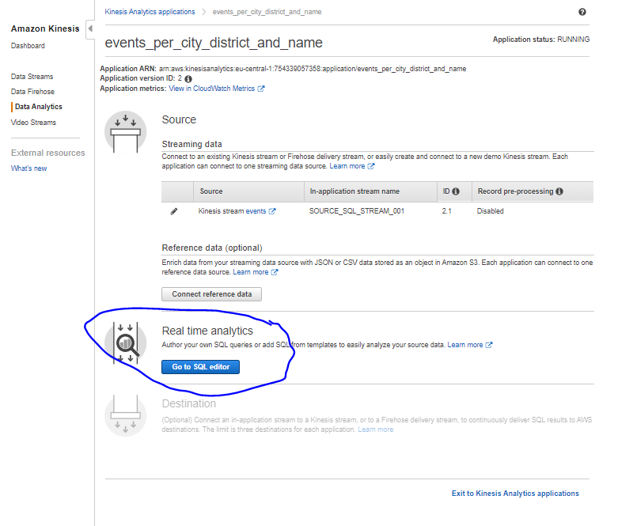

# List of exercises

On the following diagram the architecture of our solution is depicted:


* Task 1 - Deliver Data from Kinesis to S3 (to query it in near real time)
    * Exercise I   - Create a Kinesis Stream 
    * Exercise II - Register the data within Glue Data Catalog
    * Exercise III  - Save the Data from Kinesis Stream to S3 (partitioned by day and hour)
    * Exercise IV  - Query the data 
* Task 2 - Run Kinesis Analytics to analyze windows of data
    * Exercise V   - Create a Lambda Function that will read from Kinesis Analytics Application and push the Data to Cloudwatch Metrics 
    * Exercise VI - Create a Kinesis Analytics application
    * Exercise VII  - Create a Cloudwach Dashboard and display the metrics


## Task 1 - Deliver Data from Kinesis to S3 (to query it in near real time) 

In the next 3 exercises we will: 
1) Generate events 
2) Stream them to an AWS Kinesis Data Stream
3) Using Kinesis Firehose we will then store the events in S3
4) Using AWS Glue Data Catalog we will register them and made available to query tools (e.g. Athena)
5) We will query the data in Athena

### Exercise I   - Create a Kinesis Stream  

* Verify you are logged in the eu-central-1 AWS region.
* Go to the Kinesis Mgmt Console and create a data stream.
* Call the stream **events**. Select 1 as the number of shards.


* Now go to your AWS CLI.
We will invoke the event generator. It will generate events with the following structure:

```
{"id":"25a652c2-725e-4eaf-8471-aa020d623e02","timestamp":"2020-01-30 20:12:44","city":"Wroclaw","district":"South-West","eventName":"Info","eventValue":"Bad Air condition"}
{"id":"d8518eb2-87f8-441c-a77e-430cafafc406","timestamp":"2020-01-30 20:12:44","city":"Katowice","district":"South-West","eventName":"Alert","eventValue":"Traffic Jam"}
{"id":"04c939b5-f057-4654-8d76-6a1edd1ea744","timestamp":"2020-01-30 20:12:44","city":"Poznan","district":"South-East","eventName":"Warning","eventValue":"Bad Air condition"}
{"id":"f03f441e-0fc7-4f89-a17e-ba8dad33f4e1","timestamp":"2020-01-30 20:12:44","city":"Wroclaw","district":"South-East","eventName":"Alert","eventValue":"Traffic Jam"}
{"id":"e6905701-c99b-4b02-9106-713ab4bc9f90","timestamp":"2020-01-30 20:12:44","city":"Szczecin","district":"South","eventName":"Alert","eventValue":"Traffic Jam"}
{"id":"d0721e53-752e-40ff-a233-13d381b62e23","timestamp":"2020-01-30 20:12:44","city":"Katowice","district":"East","eventName":"Info","eventValue":"Intensive rain"}
{"id":"af65ebf8-bec9-439f-bd7d-790e3b63e6c7","timestamp":"2020-01-30 20:12:44","city":"Krakow","district":"South","eventName":"Warning","eventValue":"Storm incoming"}
{"id":"ad87f9be-5e88-4cc4-b913-218fc3b97924","timestamp":"2020-01-30 20:12:44","city":"Lodz","district":"South-East","eventName":"Info","eventValue":"Intensive rain"}
{"id":"e8366023-7e52-49d5-9f3e-c5dce823904a","timestamp":"2020-01-30 20:12:44","city":"Krakow","district":"South-East","eventName":"Info","eventValue":"Intensive rain"}
{"id":"3e72a980-2248-4934-af6c-5f58f4b4b042","timestamp":"2020-01-30 20:12:44","city":"Warszawa","district":"South","eventName":"Info","eventValue":"Intensive rain"}
{"id":"9a8c1513-9c26-4e06-bd5b-e97d6ad805a3","timestamp":"2020-01-30 20:12:44","city":"Wroclaw","district":"North","eventName":"Alert","eventValue":"Bad Air condition"}
{"id":"57136e33-15d0-4234-95fd-2e3118466b55","timestamp":"2020-01-30 20:12:44","city":"Lodz","district":"East","eventName":"Warning","eventValue":"Bad Air condition"}
{"id":"b784ee26-f1d0-4809-b55e-aaeb95641245","timestamp":"2020-01-30 20:12:44","city":"Szczecin","district":"West","eventName":"Info","eventValue":"Intensive rain"}
{"id":"a89b4224-ed3d-45e1-9930-06859900215d","timestamp":"2020-01-30 20:12:44","city":"Wroclaw","district":"South-West","eventName":"Warning","eventValue":"Bad Air condition"}  
```

* To invoke the event generator you need the following:
    * aws_kinesis_data_generator-1.0-SNAPSHOT-jar-with-dependencies.jar - this jar is in the directory of this exercise. Please download it to your laptop.
    * $ACCESS_KEY - aws access key of your student user
    * $SECRET_KEY - aws secret key of your student user    

* Invoke the generator:

`
java -jar aws_kinesis_data_generator-1.0-SNAPSHOT-jar-with-dependencies.jar -accesskey $ACCESS_KEY -region eu-central-1 -secretkey $SECRET_KEY  -stream_name events  
`

* Go to the Kinesis stream "events " Monitoring Tab and verify tha the events are flowing into the stream.


### Exercise II - Register the data within Glue Data Catalog

* Go to AWS Athena Console
* Select the default database and run the following query (Substitute $MY_S3_BUCKET with your S3 bucket):

```
CREATE EXTERNAL TABLE events(
  id string, 
  timestamp timestamp, 
  city string, 
  district string, 
  eventname string, 
  eventvalue string)
PARTITIONED BY ( 
  ingest_date string, 
  ingest_hour string)
ROW FORMAT SERDE 
  'org.apache.hadoop.hive.ql.io.orc.OrcSerde' 
STORED AS INPUTFORMAT 
  'org.apache.hadoop.hive.ql.io.orc.OrcInputFormat' 
OUTPUTFORMAT 
  'org.apache.hadoop.hive.ql.io.orc.OrcOutputFormat'
LOCATION
  's3://$MY_S3_BUCKET/datalake/ingest/events'
TBLPROPERTIES (
  'classification'='orc'
) 
```

* Query the table (select * from events limit 10;)
* Do you see any results? 


In the next exercise we will configure a Kinesis Firehose stream to deliver the data from stream **events** to the 
location s3://$MY_S3_BUCKET/datalake/ingest/events partitioned by ingest date and hour (2 level partitioning)

### Exercise III  - Save the Data from Kinesis Stream to S3 (partitioned by day and hour)

* Go to Kinesis Firehose Mgmt console.
* Click Create Delivery Stream.
* On Step 1 page set the following settings:

* On Step 2 page set the following settings:

* On Step 3 page set the following settings:
    * As Destination Select S3 (no other options should be selectable)
    * For S3 bucket enter the bucket name $MY_S3_BUCKET
    * For S3 prefix enter datalake/ingest/events/ingest_date=!{timestamp:YYYYMMDD}/ingest_hour=!{timestamp:HH}/
    * For S3 Error Prefix enter datalake/ingest/events_errors/ingest_date=!{timestamp:YYYYMMDD}/ingest_hour=!{timestamp:HH}/error=!{firehose:error-output-type}/
    * For S3 backup leave the option disabled
    

* Click Next
* On Step 4 page set the following settings:
   * Leave all setting on default (note the buffer interval is 1 - 15 min, default is 5 min) except for Permissions / IAM role where you need to create a new role


   * Click Next (after the service role has been created on previous screen)


* On Step 5 page review the settings and click Create Delivery Stream


* In ca. 5 minutes you should see data flowing in into S3 bucket 

### Exercise IV  - Query the data 

Now we should be ready to query the data. Before we do there are few cehcks we need to perform.

* First go to S3 Mgmt console and check whether the directory  s3://$MY_S3_BUCKET/datalake/ingest/events was created.
* If it contains subdirectories then it means our Kinesis Firehose delivery stream works and we weill soon be able to query data.
* If the directory above was not created then check if the directory datalake/ingest/events_errors/ingest_date=!{timestamp:YYYYMMDD}/ingest_hour=!{timestamp:HH}/error=!{firehose:error-output-type}/ exist. If yes you can download the files and verify waht went wrong.
* In which format are the file(s) and how often are they created?
* Make sure everything is ok and then go to Athena Mgmt console
* Again query the table events (select * from events limit 10;)
* Do you see any results? Why is that?
.....

* To see the data, you need to register new partitions. The easiest way to add new partitions is to run the "MSCK REPAIR TABLE $BALE;" command.
* Execute this command: **MSCK REPAIR TABLE events;**


* Now run the query again:


## Task 2 - Run Kinesis Analytics to analyze windows of data

### Exercise V   - Create a Lambda Function that will read from Kinesis Analytics Application and push the Data to Cloudwatch Metrics 

* First we need to create a Lambda Function that will get results from our Kinesis Data Analytics application 
and push it to Cloudwach Metrics where we will be able to display various metrics in real time.
* Go to Lambda Mgmt Console. Click on Create Function.
* On the page choose python 2.7, a name for the function (e.g. get_kinesis_data) like on the screenshot:


* Go to the Function Code block, copy the code from file lambda_kinesis_analytics_to_cloudwatch.txt and click on Save.


* Verify timeout is set to 1 min and the No VPC is selected. 


* Click on Save
* Verify that the Execution Policy contains this permission (add it if not):
```
{
            "Sid": "VisualEditor0",
            "Effect": "Allow",
            "Action": [
                "cloudwatch:PutMetricData"
            ],
            "Resource": "*"
        }
```
* Now your Lambda is ready to be invoked by Kinesis Data Analytics stream.
* What is the code in Lambda doing?

### Exercise VI - Create a Kinesis Analytics application

* Go to Kinesis Mgmt console and click “Create analytics application”


* For application name type “events_per_city_district_and_name” and choose SQL as the runtime (click Create Application).


* Click on Connect Streaming Data


* On next page select **events** kinsis data stream and click on Discover Schema


* Click on Edit Schema and rename COL_timestamp to **event_timestamp**


* Return to the application main page and click on Go to SQL editor



* Copy the SQL from file kinesiss_data_analytics.sql. Clisk on Save and run SQL
* Verify that the stream produces data (once per 10 seconds)


* Click on Close
* Now click on Connect to a destination
* Select the previously created Lambda function (Output Format: JSON) and click on Save and continue 


### Exercise VII  - Create a Cloudwach Dashboard and display the metrics

* Go to Cloudwatch Mgmt Console


* Verify that there is a new Metric in the Custom Metrics section called Emergency_events. Take a look at the values.


* Return to the Dashboard section and click on Create Dashboard. Select a name for the Dashboard
* Select the Line dashboard type and click on Configure
* Play around with the Dashboard. 
* Try to create a dashboard with auto refresh (10 sec) and metric values displayed for the last 3 Minutes (choose Max for the Statistic, 10 sec for Period)

