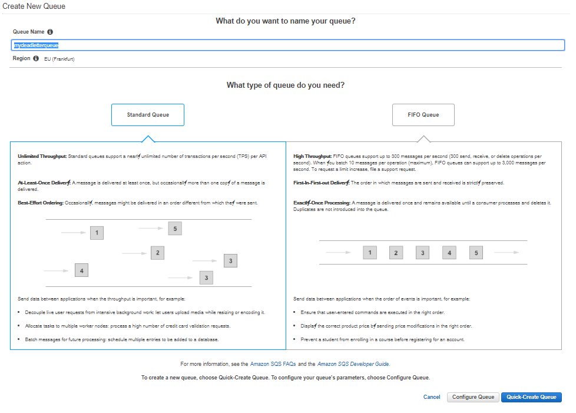

# List of exercises

## Exercise I   - Create 2 standard SQS queues (main and dead letter)   

In the following exercise we will: 
1) Create a standard SQS queue. 
2) In case some messages will not be processed successfully we will setup also a dead letter queue. 

## Exercise I   - Create 2 standard SQS queues (main and dead letter)   

* Verify that you are logged in the eu-central-1 (Frankfurt) AWS region.
* Go to the SQS Mgmt Console and click on Get Started.
* First we will create a Dead Letter queue where we will send messages from our main queue that were not processed successfully.
* Name the queue **mydeadletterqueue** and click Quick-Create Queue

* Now let us create the main application queue (named **myqueue**).
* Name the sqs queue **myqueue** (Standard queue). Click on Configure Queue.
* Ask the lecturer if any of the settings is not clear to you.
* Modify the setting for the Dead Letter queue (2 receives before moving to a DL queue, in this case mydeadletterqueue)

* Click on Create Queue
* On Mgmt Console you should have 2 queues visible:

* Send few messages to the queue **myqueue**

* Optionally set up the "Delay Delivery for message" to a value greater then 0
* Then click on View/Delete Messages for the queue **myqueue**
* Click on "Start Polling for Messages" but dont delete them. Poll 2 times.

* Return to the SQS Mgmt Console. Where are the messages you send to queue **myqueue**?
* Please note the count Messages Available for both queues -  **myqueue** and **mydeadletterqueue**
* Poll few times messages from the **mydeadletterqueue** queue. Do they disappear? Why?
* Send some more example messages to the main queue. Try to delete them. Why does a delete mean?
* Try to open 2nd browser session. Default visibility timeout is set to 30 seconds. 
Try to observe that the 2nd browser doesnt see the messages currently seen by the first browser window.

